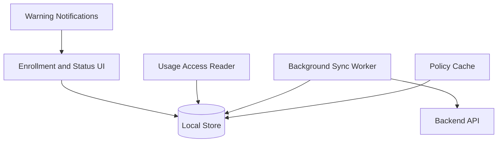
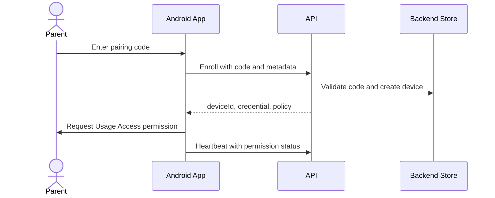

# Android Agent Architecture

## MVP Goal

The Android MVP should provide transparent monitoring, not strong enforcement.

Required MVP behaviors:

- Enroll device using pairing code.
- Request Usage Access with clear guidance.
- Report app usage where available.
- Cache policy.
- Queue events while offline.
- Show child-facing status.
- Warn near limits.
- Report permission status.

## Recommended MVP Direction

Use a standard Android app with Usage Access permission.

This is the lowest-friction consumer setup. It does not require enterprise provisioning or factory reset.

Tradeoff:

- Monitoring is realistic.
- Strong enforcement is limited.
- The child or device owner may revoke permissions.

## Component Model

## Enrollment Flow

## Usage Access Model

The app should read usage data through approved Android APIs after permission is granted.

Tracked facts:

- App package name.
- App label where available.
- Usage duration.
- Foreground intervals where available.
- Permission granted/revoked state.

Avoid:

- Notification contents.
- Message contents.
- Keystrokes.
- Screenshots.
- Accessibility-service misuse.

## Permission Handling

Required states:

- `permission_missing`
- `permission_granted`
- `permission_revoked`
- `background_restricted`
- `sync_healthy`
- `sync_failed`

The parent dashboard should show permission health honestly.

## Enforcement

MVP enforcement:

- Warnings.
- Status screen.
- Parent-visible reporting.

Not reliable in standard-app MVP:

- Hard app blocking.
- Preventing uninstall.
- Preventing permission revocation.
- Device-wide lockdown.

Future enforcement options:

- Device Owner app.
- Android Management API.

## Offline Behavior

When offline:

- Store usage summaries locally.
- Keep last known policy.
- Continue permission monitoring.
- Retry sync with backoff.

When back online:

- Submit queued usage summaries.
- Fetch latest policy.
- Report permission status.

## Security Notes

- Store device credentials using Android secure storage.
- Do not use Accessibility APIs to inspect private content.
- Do not request permissions unrelated to screen-time management.
- Keep child-facing status visible.

