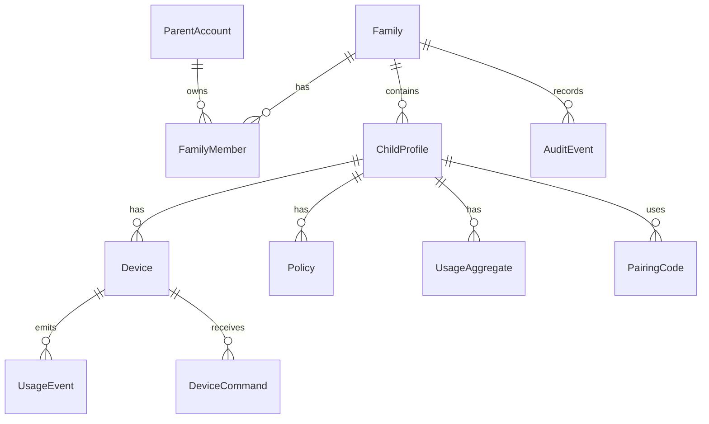

# Data Model

## Modeling Goals

The MVP data model must support:

- Parent-owned family data.
- Child profiles.
- Multiple devices per child.
- Pairing codes.
- Device credentials.
- Usage ingestion.
- Daily usage aggregates.
- Policies and policy versions.
- Device command queues.
- Audit events.

The backend should be able to answer:

- Which children belong to this parent?
- Which devices belong to this child?
- What is this child's usage today?
- What policy applies to this child?
- What commands are pending for this device?
- What changed recently?

## Conceptual Entity Diagram

## Entities

### ParentAccount

Fields:

- `parentId`
- `email`
- `displayName`
- `createdAt`
- `status`

Notes:

- Parent authentication should be delegated to Cognito.
- The backend should store only application profile metadata.

### Family

Fields:

- `familyId`
- `ownerParentId`
- `name`
- `createdAt`
- `status`

### FamilyMember

Fields:

- `familyId`
- `parentId`
- `role`
- `createdAt`
- `status`

MVP can support only one owner, but the model should not block future co-parent accounts.

### ChildProfile

Fields:

- `childId`
- `familyId`
- `displayName`
- `timezone`
- `createdAt`
- `status`

### Device

Fields:

- `deviceId`
- `familyId`
- `childId`
- `platform`
- `name`
- `agentVersion`
- `lastSeenAt`
- `enrollmentStatus`
- `policyVersion`
- `status`
- `createdAt`
- `revokedAt`

### DeviceCredential

Fields:

- `deviceId`
- `credentialId`
- `credentialHash`
- `createdAt`
- `rotatedAt`
- `revokedAt`
- `status`

Credential requirements:

- Store hashes, not raw credentials.
- Support revocation.
- Support rotation.
- Scope credential to one device.

### PairingCode

Fields:

- `pairingCodeId`
- `familyId`
- `childId`
- `codeHash`
- `expiresAt`
- `createdAt`
- `consumedAt`
- `status`

Requirements:

- Short expiration.
- Single use.
- Rate-limited exchange attempts.
- Audit code creation and consumption.

### UsageEvent

Fields:

- `eventId`
- `familyId`
- `childId`
- `deviceId`
- `timestamp`
- `eventType`
- `appId`
- `appName`
- `category`
- `durationSeconds`
- `idempotencyKey`
- `metadata`

### UsageAggregate

Fields:

- `childId`
- `date`
- `familyId`
- `totalSeconds`
- `byDevice`
- `byApp`
- `overlapStrategy`
- `updatedAt`

MVP overlap strategy:

- `merge_child_intervals`

### Policy

Fields:

- `policyId`
- `familyId`
- `childId`
- `version`
- `rules`
- `createdAt`
- `updatedAt`
- `createdByParentId`

MVP rules:

- Daily limit.
- Allowed schedule.
- Manual lock state.
- Bonus time.
- Warning threshold.

### DeviceCommand

Fields:

- `commandId`
- `familyId`
- `deviceId`
- `commandType`
- `payload`
- `status`
- `createdAt`
- `availableAfter`
- `acknowledgedAt`
- `expiresAt`

Command types:

- `apply_policy`
- `lock`
- `unlock`
- `show_warning`
- `refresh_config`

### AuditEvent

Fields:

- `auditId`
- `familyId`
- `actorType`
- `actorId`
- `action`
- `targetType`
- `targetId`
- `timestamp`
- `metadata`

## DynamoDB Strategy

MVP can use either a single-table design or a small multi-table design.

Recommended MVP:

- Start with a small multi-table design for clarity.
- Use DynamoDB on-demand capacity.
- Revisit single-table only if access patterns and scale justify it.

Suggested logical tables:

- `Families`
- `Children`
- `Devices`
- `Policies`
- `UsageEvents`
- `UsageAggregates`
- `DeviceCommands`
- `AuditEvents`
- `PairingCodes`

This is easier to reason about during early development than a dense single-table model.

## Required Access Patterns

Parent dashboard:

- List families for parent.
- List children for family.
- Get child detail.
- List devices for child.
- Get today's usage for child.
- List audit events for family.
- Get current policy for child.

Device agent:

- Get device by credential.
- Update heartbeat.
- Submit usage events idempotently.
- Fetch current policy.
- Fetch pending commands.
- Acknowledge command.

Backend jobs:

- Aggregate usage by child and date.
- Expire pairing codes.
- Expire old commands.
- Detect offline devices.

## Idempotency

Device-submitted events must include an idempotency key.

Recommended key shape:

- Device ID.
- Local event sequence number.
- Event start timestamp.

The backend must reject duplicate usage events without double-counting.

