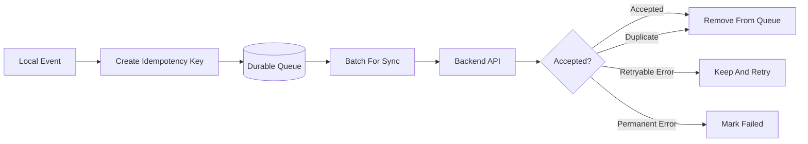
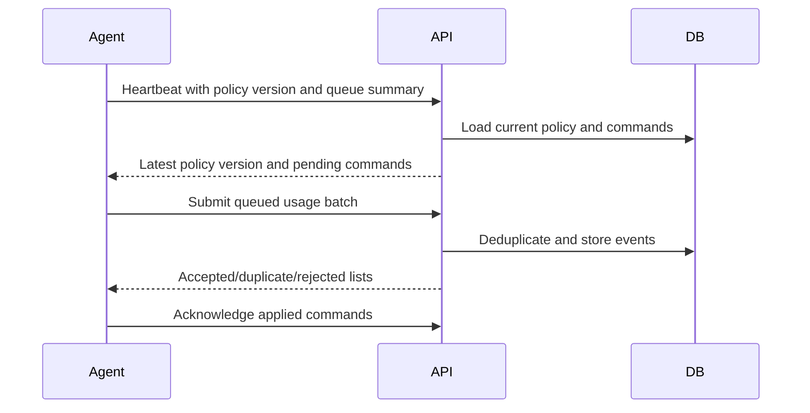

# Offline Sync Architecture

## Goals

Agents must tolerate:

- Backend downtime.
- Network outages.
- Device sleep.
- Reboot.
- Temporary authentication failures.

The system must avoid:

- Data loss where reasonable.
- Duplicate usage counting.
- Unsafe policy changes while offline.
- Silent failure.

## Agent Local State

Each agent should maintain:

- Device identity.
- Device credential.
- Last known policy.
- Last successful sync timestamp.
- Local usage event queue.
- Local command acknowledgement queue.
- Local diagnostics queue.

## Queue Model

## Idempotency

Every usage event must include an idempotency key.

Recommended fields:

- Device ID.
- Local sequence number.
- Event start timestamp.
- Event type.

Backend behavior:

- Accept first event with a key.
- Treat duplicate key as already accepted.
- Never double-count duplicate events.

## Sync Cadence

Default MVP cadence:

- Heartbeat every 5 minutes.
- Usage batch at heartbeat or when local queue reaches threshold.
- Faster polling only when near limit or blocked.

Adaptive polling:

- Allowed and healthy: slower.
- Near limit: faster.
- Manual lock pending: faster once agent sees command.
- Offline: exponential backoff.

## Policy Cache

Cached policy should include:

- Policy version.
- Rules.
- Server timestamp.
- Expiration guidance.
- Last successful fetch timestamp.

Offline enforcement:

- If cached policy says blocked, continue blocked.
- If cache is stale but valid, continue last known rules.
- If no cache exists, default to allowed but report degraded state when possible.

## Conflict Handling

Examples:

- Parent grants bonus time while device is offline.
- Device continues enforcing old blocked state.
- Device reconnects and receives updated policy.
- Device applies new policy and records audit/ack state.

Rule:

- Backend policy wins after sync.
- Agent should not invent new policy.

## Reconciliation Flow

## Failure Handling

| Failure | Agent Behavior |
|---|---|
| Network unavailable | Queue and retry |
| 5xx response | Retry with backoff |
| Rate limited | Respect retry guidance |
| Credential revoked | Stop normal sync and show re-enrollment required |
| Validation failure | Mark event failed and upload diagnostic |
| Policy unsupported | Keep old policy and report version error |

