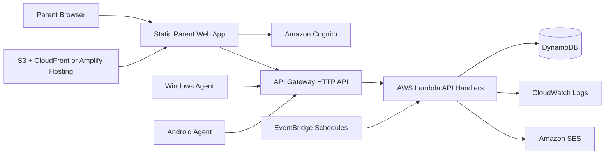
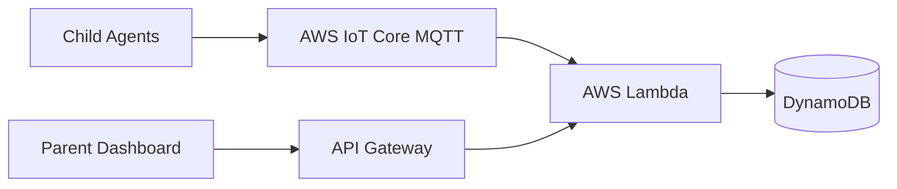
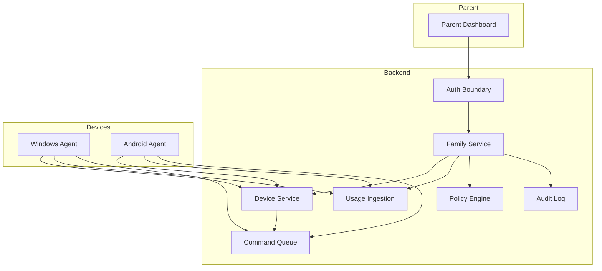
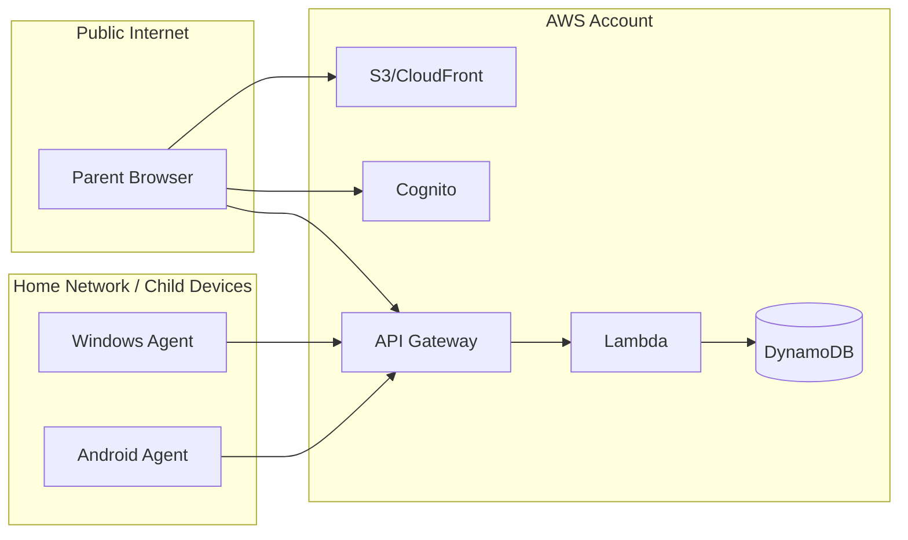
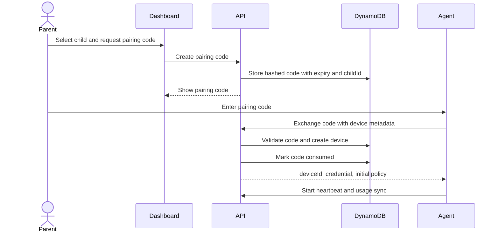
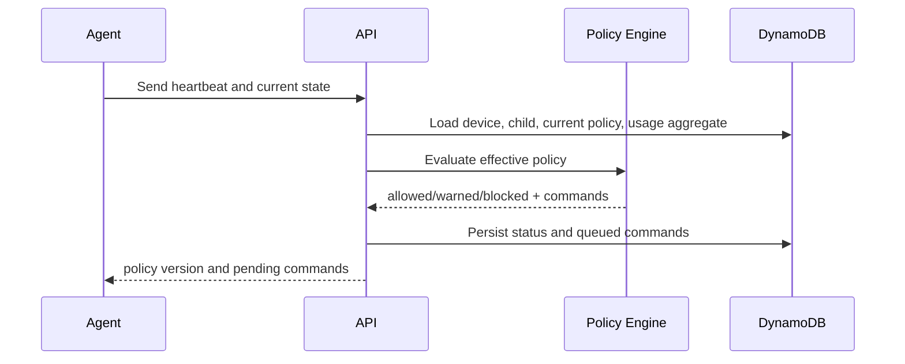
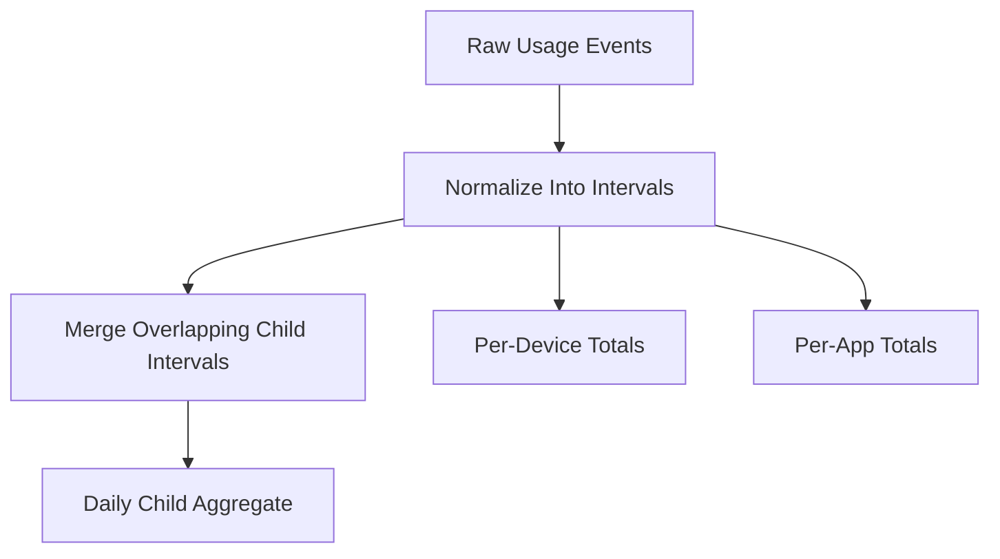

# Architecture Overview

## Recommended MVP Architecture

The MVP should use a serverless AWS backend, a static parent dashboard, and polling child agents.

## Core Design Choice

Start with HTTPS polling instead of real-time device messaging.

Reasons:

- Lowest complexity.
- Low idle cost.
- Easy for Windows and Android agents.
- Works through common home networks.
- Avoids adding AWS IoT Core until there is a concrete need.

Possible later evolution:

## Logical Components

## Trust Boundaries

Security implication:

- Parent browser and child agents are untrusted clients.
- API Gateway and Lambda must validate every request.
- DynamoDB is not directly exposed.
- Parent identity and device identity are separate trust models.

## Device Enrollment Flow

## Policy Evaluation Flow

## Usage Aggregation Model

Agents send raw events and interval summaries. The backend stores raw events and computes child-level daily aggregates.

MVP overlap rule:

- Count overlapping usage once per child.
- Preserve per-device totals separately for reporting.

## Availability Assumptions

- Backend availability is best-effort serverless.
- Agents must continue local tracking when offline.
- Agents must cache last known policy.
- Agents must queue events locally.
- Backend must deduplicate usage events.

## Implementation Boundary

This document describes architecture only. It intentionally does not define source files, Terraform resources, or framework-specific code.

