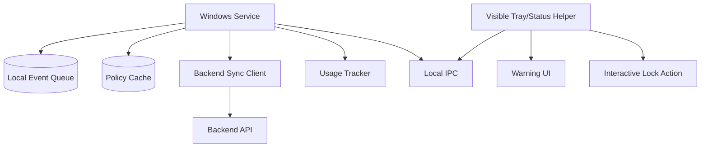
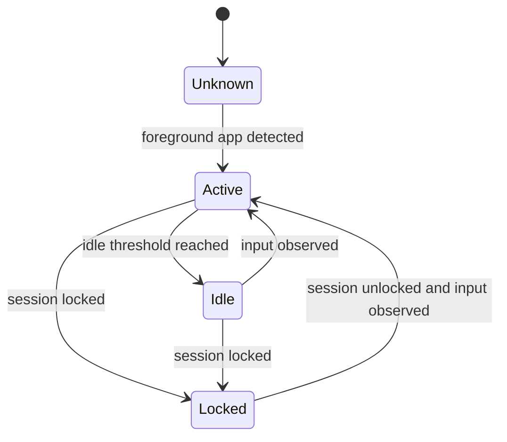

# Windows Agent Architecture

## MVP Goal

The Windows agent should provide the first practical enforcement path.

Required MVP behaviors:

- Enroll device using pairing code.
- Authenticate as a registered device.
- Start after reboot.
- Track active foreground app usage.
- Detect idle time.
- Cache policy locally.
- Queue events while offline.
- Sync with backend.
- Show visible child-facing status.
- Warn before time expires.
- Lock the Windows session when policy requires it.

## Recommended Process Model

## Why Service Plus Helper

Windows services are good for:

- Starting on boot.
- Long-running background sync.
- Local persistence.
- Policy cache.
- Event queue.

A visible helper process is good for:

- Child transparency.
- Tray/status UI.
- Warning prompts.
- Interactive desktop actions.

Some user-interface and session actions are more reliable from a process running in the user's interactive session than directly from a service.

## Local Components

### Installer

Responsibilities:

- Install the service.
- Configure auto-start.
- Install visible helper.
- Register helper to start for child user sessions.
- Store installation metadata.

### Windows Service

Responsibilities:

- Maintain device identity.
- Sync with backend.
- Track current policy.
- Persist queue.
- Persist policy cache.
- Monitor helper health.
- Submit usage events.
- Fetch commands.
- Record diagnostics.

### Tray/Status Helper

Responsibilities:

- Show product presence.
- Show current state: allowed, warning, blocked, offline.
- Show time remaining if available.
- Display warnings.
- Perform interactive lock when requested by service.

### Local Event Queue

Requirements:

- Durable across reboot.
- Ordered by local sequence.
- Idempotency key per event.
- Retry with backoff.
- Bounded storage.

### Policy Cache

Requirements:

- Store last known policy.
- Store policy version.
- Store last successful sync timestamp.
- Support offline enforcement.
- Avoid corrupt partial writes.

## Tracking Model

Tracked facts:

- Active interval start.
- Active interval end.
- Idle interval start.
- Foreground process/app identity.
- Session lock/unlock events.
- Policy state at time of interval.

Avoid:

- Full window titles if they expose private content.
- Keystrokes.
- Screenshots.
- Browser contents.

## Enforcement Model

MVP enforcement:

- Warning command or local warning threshold.
- Lock session when limit exceeded or manual lock active.
- Re-lock if child unlocks while still blocked.

Deferred enforcement:

- Closing blocked apps.
- Preventing app launches.
- Windows AppLocker integration.
- Windows account policy changes.

## Offline Behavior

When offline:

- Continue tracking.
- Continue applying cached blocked state.
- Queue usage events.
- Retry sync with backoff.
- Show offline state in helper.

When back online:

- Submit queued events.
- Fetch current policy.
- Apply latest commands.
- Acknowledge command results.

## Failure Modes

| Failure | Required Behavior |
|---|---|
| Backend unavailable | Queue events and use cached policy |
| Queue full | Stop collecting low-value diagnostics before usage events |
| Policy cache missing | Default to allowed but visible degraded state |
| Helper not running | Service restarts helper or records diagnostic |
| Device credential revoked | Stop syncing private data and show re-enrollment required |

## Security Notes

- Store device credential securely using OS-appropriate secret storage.
- Do not log credential values.
- Do not hide the agent.
- Do not attempt to bypass Windows security boundaries.
- Admin install should be explicit.

