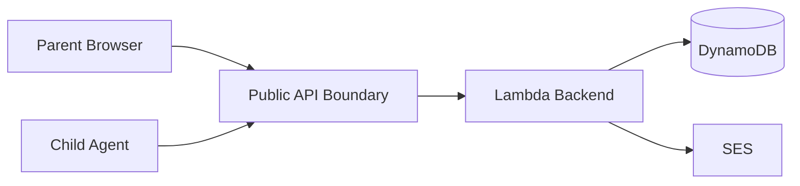

# Threat Model

## Scope

This threat model covers the MVP:

- Parent dashboard.
- Backend API.
- Device enrollment.
- Windows agent.
- Android agent.
- Usage reporting.
- Policy enforcement.
- AWS infrastructure.

## Assets

Sensitive assets:

- Parent account identity.
- Family membership.
- Child profiles.
- Device identities.
- Device credentials.
- Usage events.
- Policy rules.
- Manual lock/unlock commands.
- Audit events.

Highly sensitive behaviors:

- Device lock commands.
- Device enrollment.
- Policy changes.
- Credential rotation.
- Credential revocation.

## Actors

Legitimate actors:

- Parent or guardian.
- Child using a managed device.
- Device agent.
- Backend service.

Potential attackers:

- Unauthenticated internet user.
- Authenticated parent attempting to access another family.
- Child attempting to bypass limits.
- Malware on child device.
- Compromised device credential.
- Compromised parent account.
- Accidental operator error.

## Trust Boundaries

Controls at API boundary:

- Parent JWT validation.
- Device credential validation.
- Request validation.
- Rate limiting.
- Ownership checks.

## Threats And Mitigations

### Parent Accesses Another Family

Risk:

- Privacy breach.

Mitigations:

- Every parent API checks family membership.
- Do not trust IDs from the client.
- Audit access-sensitive changes.
- Automated authorization tests in later phases.

### Device Submits Usage For Another Device

Risk:

- Corrupt usage data.
- Incorrect enforcement.

Mitigations:

- Device token is scoped to one device.
- Backend derives device identity from credential.
- Reject mismatched `deviceId`.
- Use idempotency keys.

### Pairing Code Is Guessed

Risk:

- Unauthorized device enrollment.

Mitigations:

- Short expiration.
- Single-use codes.
- Store only code hashes.
- Rate-limit attempts.
- Audit failed attempts.
- Use sufficient entropy.

### Device Credential Is Stolen

Risk:

- Fake heartbeats or usage events.
- Command polling by attacker.

Mitigations:

- Revocable device credentials.
- Credential rotation.
- Store credential hashes.
- Device anomaly detection later.
- Do not expose other family data to device APIs.

### Child Disables Agent

Risk:

- Monitoring or enforcement stops.

Mitigations:

- Last-seen status.
- Offline-device alert.
- Windows service persistence.
- Android permission status reporting.
- Honest limitation disclosure.

### Backend Double-Counts Usage

Risk:

- Incorrect lock enforcement.

Mitigations:

- Idempotency keys.
- Raw event retention.
- Recomputable aggregates.
- Explicit overlap strategy.

### Manual Lock Command Abused

Risk:

- Incorrect or malicious device lock.

Mitigations:

- Parent authentication.
- Ownership check.
- Audit event.
- Command expiry.
- Device command acknowledgement.

### Sensitive Data In Logs

Risk:

- Credential or child data exposure.

Mitigations:

- Structured logging.
- Redact tokens and pairing codes.
- Avoid logging request bodies by default.
- Explicit log retention.

### AWS Credential Misuse

Risk:

- Infrastructure compromise.

Mitigations:

- Least-privilege deployment role.
- MFA for human users.
- No long-lived automation keys where possible.
- Remote state access restricted.
- Budget alerts.

## Explicitly Disallowed Features

The system must not implement:

- Keylogging.
- Covert screenshots.
- Hidden camera access.
- Hidden microphone access.
- Credential theft.
- Browser password capture.
- Private message capture.
- Stealth installation.
- Security-boundary bypass.

## Security Acceptance Criteria For MVP

Before MVP is considered usable:

- Parent API authorization is tested.
- Device API scoping is tested.
- Pairing codes expire and are single-use.
- Device credentials are revocable.
- Audit events exist for enrollment and policy changes.
- No secrets are logged.
- Child-facing transparency is present in agents.

